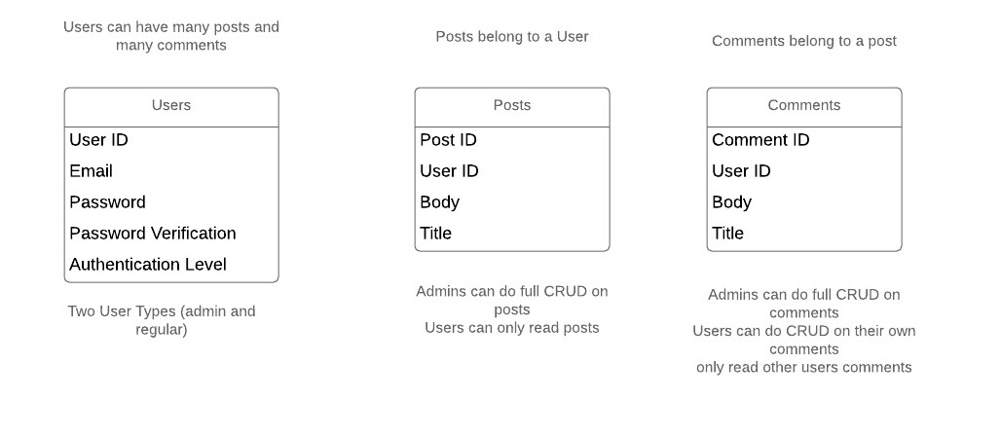

# sportsblog
a sports blog site where sports articles are posted and users can leave comments on the articles

## Instructions to get App running
clone project  
rails db:drop db:create db:migrate db:seed  
npm i  
CD into client  
npm i  
rails start  

### Back-End Construction
Ruby on Rails  

## Front-End Construction
React

## Navbar
Home(Articles View), Login/Logout options,

## MVP
a sports blog where sports articles are posted and users can leave comments on the articles.
all people can view articles (no auth required)
but to post a comment you will need to be logged in
to post an article, update an article or remove an article, you will need to be logged in and authorized

## Models
Users (Admin access level and basic user access level)  
Articles  
Comments  

## Technologies Used
React  
Ruby on Rails  
Ant Design Library  
React-tooltip  
Heroku Deployment  
JWT decode  
JWT web token  
Axios  
Local Storage  

## Post MVP
Search function  
Favorites  
Roster/Stats Tab  
Social Media Links  
About Page  
Shopping Links (Tickets, Merch)  
Mailbag (Send questions to site admins)  
